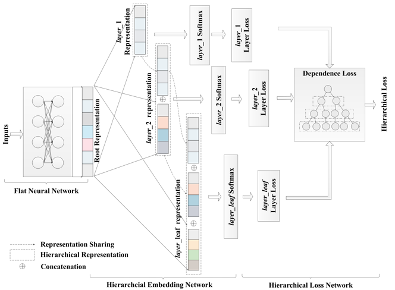

# Deep Hierarchical Classification

This is a non-official implementation of [Deep Hierarchical Classification for Category Prediction in E-commerce System][1]. 

## Introduction
In this implementation of Deep Hierarchical Classifier **(DHC)**, ResNet50 with CBAM is used as the backbone network. Cifar-100 dataset was used to test the performance of DHC. Cifar-100 is a dataset that contains 20 classes (superclasses) where each class has 5 subclasses. Each of these subclasses has 600 images (500 training - 100 testing). Therefore, in total there are 100 subclasses and 20 superclasses. 

## How to Use
In order to use this implementation on your own custom dataset, make sure to have a ``train.csv``, ``test.csv`` and a metafile for your dataset. You can refer to the files in ```dataset``` folder for more information. You will also need to modify the dictionary variable in ```level_dict.py``` according to your dataset's hierarchy. Be sure to modify ```load_dataset.py``` file to load your dataset as well. Finally, if your dataset contains more than 2 levels of hierarchy, be sure to add the classifier layers in ```models/resnet50.py``` . 

To perform the training on your dataset, run
```
python train.py --train_csv [PATH TO YOUR TRAIN CSV FILE] --test_csv [PATH TO YOUR TEST CSV FILE] --metafile [PATH TO YOUR METAFILE]
```
To know more about the arguments that can be supplied to the train file, run
```python train.py -h```

## Architecture
 <div align="center"> 
<b>Architecture of DHC</b>
</div>
 <figure class="image">
  
  <figcaption> Source : [Deep Hierarchical Classification for Category Prediction in E-commerce System][1] </figcaption></div>
</figure>


[1]: https://arxiv.org/pdf/2005.06692.pdf "Deep Hierarchical Classification for Category Prediction in E-commerce System"

