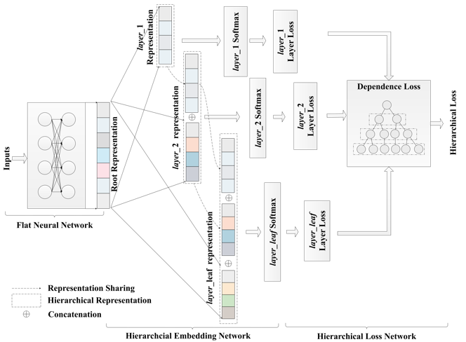
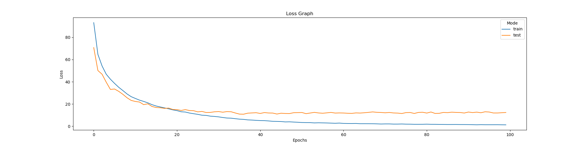
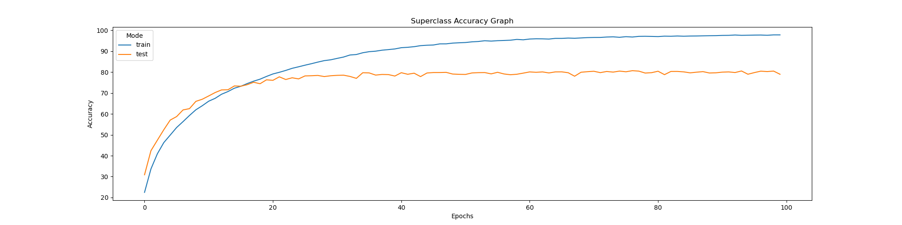
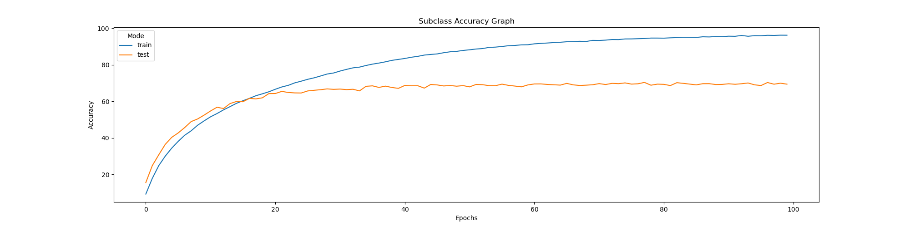
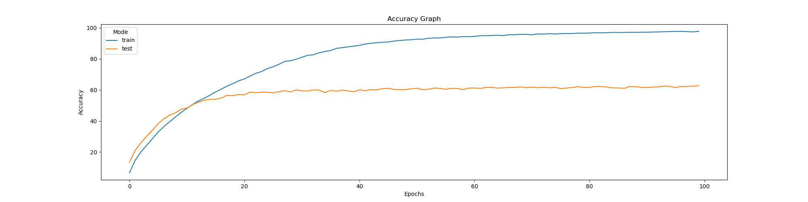

# Deep Hierarchical Classification

This is a non-official implementation of [Deep Hierarchical Classification for Category Prediction in E-commerce System][1]. 

## Introduction
In this implementation of Deep Hierarchical Classifier **(DHC)**, ResNet50 with CBAM is used as the backbone network. Cifar-100 dataset was used to test the performance of DHC. Cifar-100 is a dataset that contains 20 classes (superclasses) where each class has 5 subclasses. Each of these subclasses has 600 images (500 training - 100 testing). Therefore, in total there are 100 subclasses and 20 superclasses. 

## How to Use
In order to use this implementation on your own custom dataset, make sure to have a ``train.csv``, ``test.csv`` and a metafile for your dataset. You can refer to the files in ```dataset``` folder for more information. You will also need to modify the dictionary variable in ```level_dict.py``` according to your dataset's hierarchy. Be sure to modify ```load_dataset.py``` file to load your dataset as well. Finally, if your dataset contains more than 2 levels of hierarchy, be sure to add the classifier layers in ```models/resnet50.py``` . 

To perform the training on your dataset, run
```
python train.py --train_csv [PATH TO YOUR TRAIN CSV FILE] --test_csv [PATH TO YOUR TEST CSV FILE] --metafile [PATH TO YOUR METAFILE]
```
To know more about the arguments that can be supplied to the train file, run
```python train.py -h```

## Architecture
 <div align="center"> 
<b>Architecture of DHC</b>
</div>
<div align="center">
 <figure class="image">
  <br />
  <figcaption> Image Source : https://arxiv.org/pdf/2005.06692.pdf </figcaption>
</figure>
</div>

The feature vector from the backbone network is first used to identify the superclass of the input image. This is done through the use of a fully-connected layers where the final layer's number of neurons is the same as the number of superclasses. In our case, the final layer produces a 20-D prediction vector. Softmax will then be applied to this 20-D vector to get a prediction of the superclass.

At the same time, the same feature vector is also used to determine the subclass of the input image. The feature vector will first go through another fully-connected layers where the final layer's number of neurons is the same as the number of subclasses. In other words, 100-D vector is produced. This 100-D vector will first be concatenated with the previous level's prediction (the 20-D vector before softmax is applied)  as shown in the above figure and then again be transformed into a 100-D vector ( This operation is not shown in the image. Take a look at **eq.4** from the original paper for more info.) through the use of one more fully-connected layers.  This final 100-D vector will undergo a softmax function to produce the final prediction of the subclass of the input image.

There are 2 types of losses for this network. The second loss type punishes the network when the prediction of the subclass does not belong to its superclass. In this implementation, that particular loss function is slightly modified. However, experiments showed that the modification does not affect the performance at all. For more information, take a look at ```model/hierarchical_loss.py``` file.

### Experimental Results
As mentioned earlier, the DHC model was tested on Cifar-100 dataset. Figures below show the result of the experiment.


<div align="center">
 <figure class="image">
  <br />
  <figcaption> Loss of the model over 100 epochs. </figcaption>
</figure>
</div>


<div align="center">
 <figure class="image">
  <br />
  <figcaption> Accuracy of the model on the superclass level over 100 epochs. </figcaption>
</figure>
</div>


<div align="center">
 <figure class="image">
  <br />
  <figcaption> Accuracy of the model on the subclass level over 100 epochs. </figcaption>
</figure>
</div>

## Conclusion
One of the older technique to perform classifications on a dataset with multiple hierarchy was to have separate models for each level of hierarchy. This technique ensures the accuracy of the prediction is not lost due to the hierarchical structure of the class. However, it is not cost-effective as there'll be many models in the end to be managed. 

Therefore, it is crucial to know if this proposed DHC algorithm does any trade-off between the accuracy of the predictions and the cost of having multiple models or not. For confirmation, another experiment was done using only the ResNet-50 with CBAM on Cifar-100 subclass level. The figure below shows the accuracy of the model. 

<div align="center">
 <figure class="image">
  <br />
  <figcaption> Accuracy of ResNet-50 with CBAM on the subclass level over 100 epochs. </figcaption>
</figure>
</div>

From the figure above it can be seen that the ResNet-50 with CBAM model alone achieves almost the same accuracy as the DHC. Note that DHC has about 10% more accuracy than ResNet-50 with CBAM. This might be due to the use of slightly more aggressive data augmentation during training for DHC. 

In conclusion, for Cifar-100 dataset with 2 levels of hierarchy, proposed DHC algorithm does not forsake any accuracy in order to save the cost of having multiple models at all. Perhaps with the use of a different backbone network, the accuracy can be greatly improved.


[1]: https://arxiv.org/pdf/2005.06692.pdf "Deep Hierarchical Classification for Category Prediction in E-commerce System"

